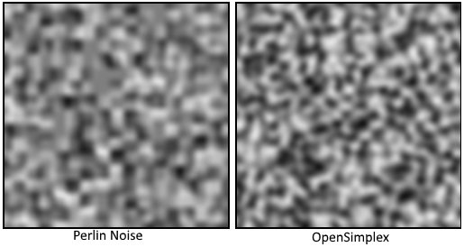

# OpenSimplexNoise

This generates smoothly-changing deterministic random values in
2, 3, or 4 dimensions. This can be used for procedurally generated textures,
shapes, or terrain.



OpenSimplex noise is a Dart implementation of Kurt Spencer's patent-free
alternative to Classic Perlin and Simplex noise.

## Usage

```dart
import 'package:open_simplex_noise/open_simplex_noise.dart';

OpenSimplexNoise noise = new OpenSimplexNoise();

void main() {
  ...
  double value = noise.eval3D(x, y, z);
  ...
}
```

## Installing

- Clone this repo locally
- Install [Dart 2](https://webdev.dartlang.org/)
- Run `pub get`

## Run unit-tests

- Run `pub run test/test.dart`

## More information

- [Uniblock Dev Blog](http://uniblock.tumblr.com/post/97868843242/noise)
- [KdotJPG/OpenSimplexNoise.java](https://gist.github.com/KdotJPG/b1270127455a94ac5d19)
- [ojrac/opensimplex-go](https://github.com/ojrac/opensimplex-go)
